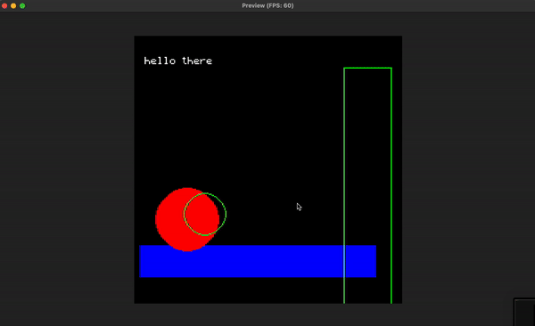

More like a 2D-primitivies drawing engine made in Swift/Metal that can be very easily fact a SwiftUI's View.

Some capabilities and characteristics:

- Number of pixels in the window is independent of window's size - i.e. one can go for 16x16 screen in a window that spans whole FullHD screen.
- Drawing primitives - lines, triangles, rectangles and circles
- Drawing text
- Reading mouse and keyboard input
- Maybe something more!